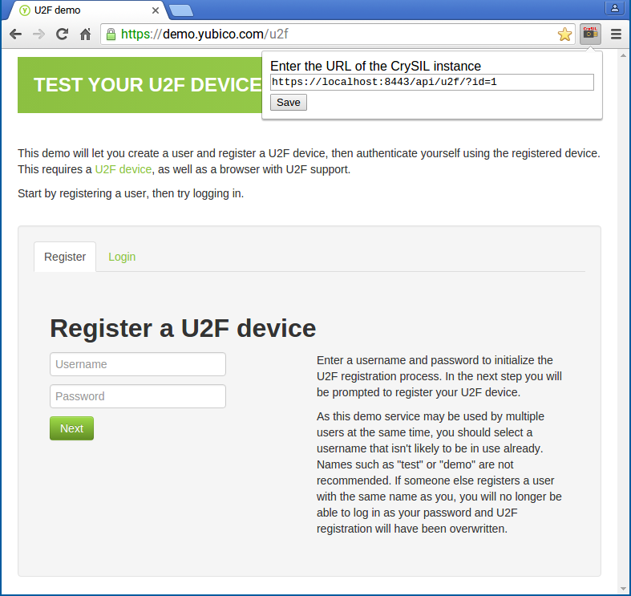

# Chromium U2F CrySIL Module

This extension for [Chromium](https://www.chromium.org/) enables usage of any CrySIL instance as a U2F authenticator. After installation, this extension shows a new button in the Chromium toolbar to configure the URL of the running CrySIL instance. Every registration and authentication request by a U2F-enabled website will be forwarded to this instance.

This extension uses several other projects to perform needed operations (hashing, reading X.509 certificates) in JavaScript:

* [base64-js](https://github.com/beatgammit/base64-js/)
* [Base 64](http://www-cs-students.stanford.edu/~tjw/jsbn/base64.js)
* [forge-sha256](https://github.com/brillout/forge-sha256)
* [ASN1.js](https://github.com/GlobalSign/ASN1.js/)
* [PKI.js](https://github.com/GlobalSign/PKI.js)

## Prerequisites 

Unfortunately, support for forwarding U2F requests to other extensions has been dropped in the [cryptotoken extension](https://chromium.googlesource.com/chromium/src.git/+/master/chrome/browser/resources/cryptotoken/) in Chromium. Therefore, running the extension requires [patching](./0001-mod-chromium.patch) the Chromium source and [building the browser](https://chromium.googlesource.com/chromium/src/+/master/docs/linux_build_instructions.md) itself. The patch restores functionality found in the older [U2F extension for Chrome](https://github.com/google/u2f-ref-code/).

## U2F Compatibility

The background script [`background.js`](./background.js) will receive all U2F requests from the cryptotoken extension. It then uses [`crysiladapter.js`](./crysiladapter.js) to convert the U2F commands into CrySIL commands and sends them to the CrySIL instance configured. It may prompt the user for a PIN if the CrySIL instance requires `SecretAuth` or `SecretDoubleAuth` authentication.

## Usage

Clone this repository to a local directory. Chromium (or Chrome) need to be in developer mode to load this unpacked extension from the tools menu. See the [developer documentation](https://developer.chrome.com/extensions/getstarted#unpacked) for details. The browser will then show an additional icon in the toolbar, as shown in the screenshot below. Enter the URL of you CrySIL instance (or the Android webservice) and save it. Then on any U2F-enabled website, all challenges will be forwarded to that URL. If the extension appears to not forward requests, you should reload the extension and then re-open the tab of the website.

