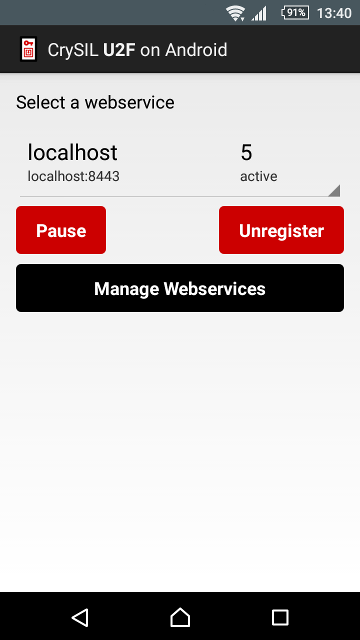

# CrySIL U2F on Android

This app implements a CrySIL U2F instance on Android, by using the [CrySIL instance](./../instance/). The app can be installed on any Android device running Android 4.0 or later. U2F clients connect to a [webservice](./../webservice/) which forwards the request to the registered CrySIL server.

You have to register a [GCM application](https://developers.google.com/cloud-messaging/registration) with Google and enter your keys in the file [`google-services.json`](./app/google-services.json). See [Set up a GCM Client App on Android](https://developers.google.com/cloud-messaging/android/client) for details.

Process to start from scratch:

* Install this app on an Android device
* The device needs Google Play Services installed to use Google Cloud Messaging
* Make sure the webservice is running and accessible
* Within the app, register the CrySIL instance on the webservice
* The webservice assigns an ID to the server
* The U2F client sends a request to the webservice, specifying the instance ID
* The webservice sends a push notification to the mobile device (with Google Cloud Messaging)
* The CrySIL app receives the notification and establishes a secure WebSocket connection to the webservice
* The webservice forwards the request from the U2F client to the Android device
* The Android device handles the requests and sends responses over the WebSocket to the webservice
* The WebSocket connection from the Android device to the webservice will stay open for further requests

## Features

* Manage webservices, with the possibility to register on more than one webservice
* Callback for the user to accept certificates provided by webservices
* Option to select the actor to handle the incoming U2F request

Screenshot of the interface:

## Handling a U2F Operation

Process when a U2F client sends a request to the webservice, designated for a specific CrySIL server:

1. U2F client posts the request to `https://localhost/api/crysil/?id=1` specifying the ID of the designated server
2. Webservice looks up the server in the datastore and sends a notification via Google Cloud Messaging containing a random token and the URL of its own WebSocket endpoint to the CrySIL server app
3. Android app receives the push notification, opens a new WebSocket connection to the specified URL, e.g.
`wss://localhost/api/crysil/server?token=abcde...`
4. Webservice verifies the client TLS certificate of the Android app
5. Android app verifies the certificate of the webservice
6. Webservice forwards the request of the U2F client to the CrySIL server on the WebSocket connection established
7. Android app handles the request and sends the response over the WebSocket connection
8. Webservice forwards the response from the WebSocket connection to the HTTPS connection of the U2F client

Any existing WebSocket connection between the Android app and the webservice from requests preceding may be reused.

